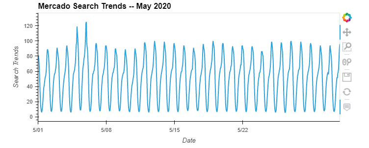
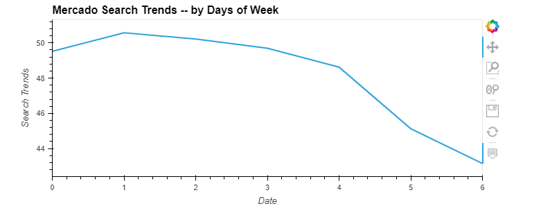
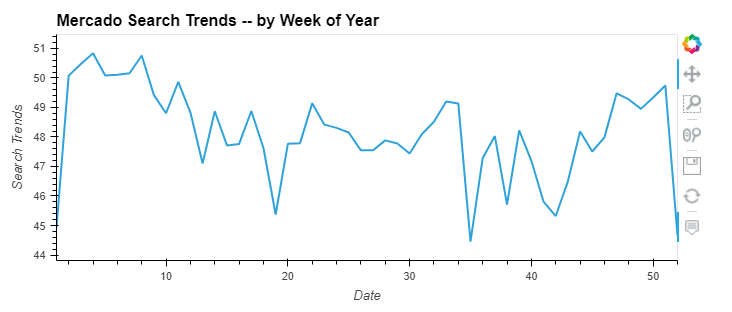
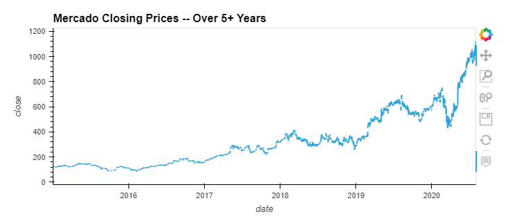
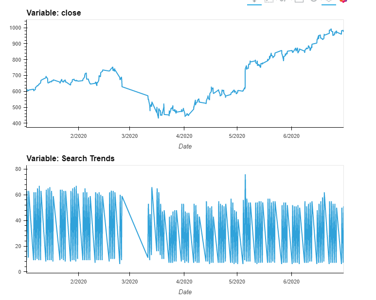

# MercadoLibre Trends and Time Series Analysis
With over 200 million users, MercadoLibre is the most popular e-commerce site in Latin America. This program was created for the purpose of finding out if the
ability to predict search traffic can translate into the ability to successfully trade the stock. We create the program using a Jupyter notebook that contains the
data preparation, analysis, and visualizations for all the time series data that the company needs to understand.

---
## Technologies
Due to issues with installing the Prophet library I used Google Colab when working on the notebook.
If you have all the libraries successfully installed and you are using VSC or JL you can skip all '!pip install X' steps inside the notebook.
This program utilizes Jupyter notebook with the following libraries:

---
## Usage
First, we want to see if there was any change in search trends when MercadoLibre released its quarterly financial results. 
To do this, we turn the original google_hourly_search_trends.csv file into a DataFrame and slice it to only the month of May 2020. 
Then we visualize the data as a line graph and see that there were increased search trends around when the announcement was made.

Next, we create a Mercado search trends by days of week visualization.
This line chart shows us that there are higher overall search trends at the start of the week.

Then we create a Mercado search trends heatmap by hours and days of week.
By breaking down the data into days of weeks and hours we can see that search trends are highest during the earlier days of the week early in the morning or late at night.

Next, we create a Mercado search trend line graph by the weeks of year.
This visualization shows us that around fall the search trends increase until they peak during the earlier months of the next year.

Then we read in a new csv and create a line graph displaying Mercado's historical closing price.
The line chart displays a very positive historical trend for Mercado's closing price.

Next, we combine Mercado's close price DF with Mercado's search trends DF and display both graphs side by side.
Using this graph, we can see that the effects of Covid on closing price and search trends were relatively short compared to other industries.

Then we calculate stock volatility and create a visualization specifically for Mercado's historical stock volatility.

Next, we use FB Prophet to create a visualization consisting of yhat, yhat_upper, and yhat_lower.
Yhat represents the most likely value, yhat_upper and yhat_lower each represent best/worst scenario at a specific time given a 95% confidence interval.
This graph shows us that the yhat values are fairly consistent overall.

Finally, we plot components using the FB Prophet forecast.
This results in four time series analysis graphs.

---
## Contributors
Kevin Gross

---
## License
This program is covered under the MIT license.